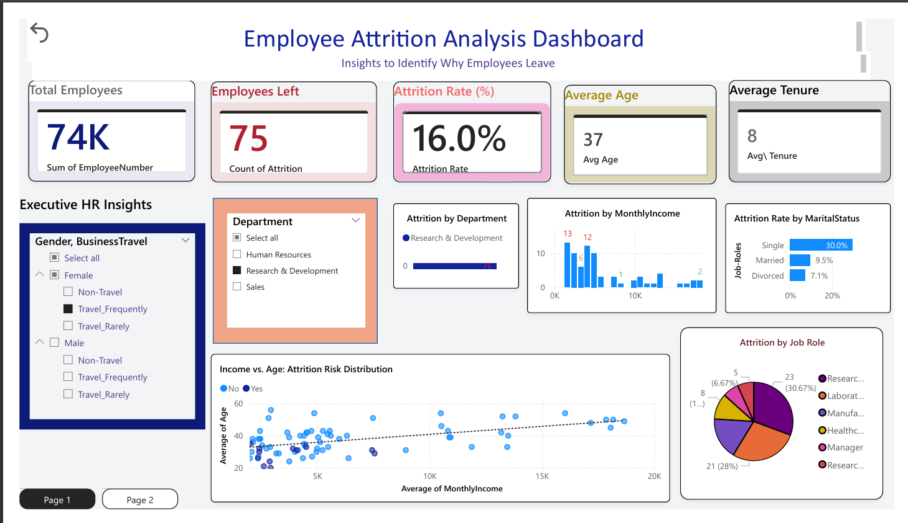
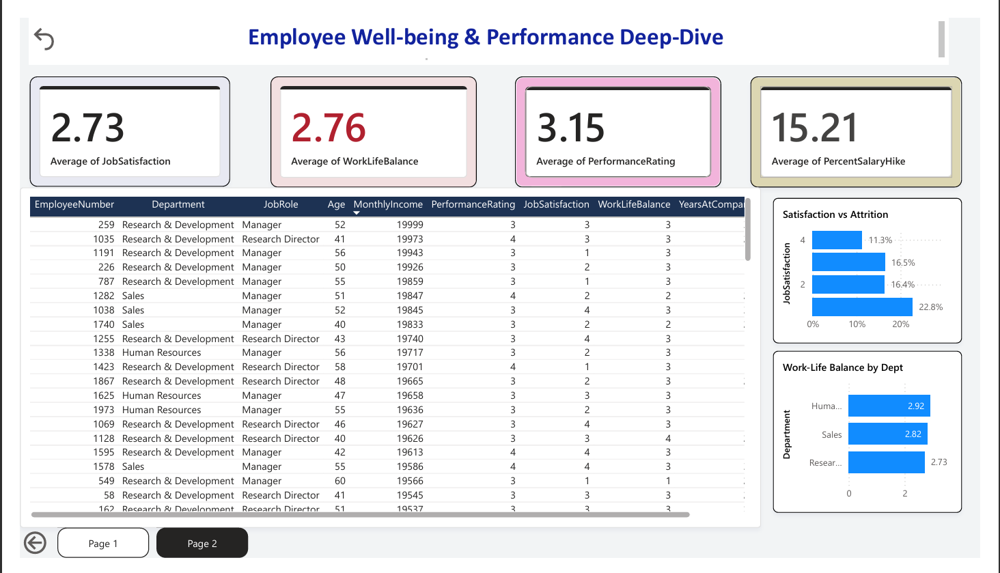

# HR Employee Attrition Analysis 📊

## Project Overview
This project analyzes employee turnover for a workforce of 1,470 employees. Using Power BI, I identified key factors causing attrition, such as Overtime, Job Role, and Monthly Income.

## Dashboard Overview
This dashboard provides a high-level and detailed view of:
* **Attrition Analysis:** Identifying high-risk departments and job roles.
* **Employee Sentiment:** Tracking Job Satisfaction and Work-Life Balance.
* **Workforce Demographics:** Age, Gender, and Education field distributions.
* **Tenure & Growth:** Analyzing years at company vs. promotion cycles.

It is designed to support **HR leaders in data-driven decision-making** to improve employee retention and engagement.
## 🖼️ Dashboard Preview
### Page 1: Executive Performance

### Page 2: Employee Well-being & Details

[▶ Watch Dashboard Demo](https://github.com/Amshavarthana-S/HR-Employee-Attrition-Dashboard/raw/main/Recording%20.mp4)

## Key Insights
* **Overtime:** Employees working overtime are 3x more likely to leave.
* **High Risk Roles:** Sales Representatives show the highest turnover rate at 40%.
* **Income Factor:** Attrition is concentrated among younger employees with lower monthly income.

## 📈 Visualizations Included

### 📅 Attrition & Risk Analysis
* **Attrition by Job Role:** Identifying roles with the highest turnover (Sales Reps).
* **Attrition by Overtime:** Visualizing the direct link between OT and exits.

### 😊 Sentiment & Performance
* **Satisfaction vs. Department:** Identifying burnout areas within the organization.
* **Performance vs. Salary Hike:** Analyzing if high performers are being rewarded fairly.

### 💰 Employee Detail Directory (Excel Style)
* **Detail Table:** A granular view of all employees with **Heatmap formatting** for Monthly Income.
* **Slicers:** Interactive filters for Department, Education, and Business Travel.
* 
## 🛠️ Tools & Technologies Used

* **Microsoft Power BI**
* **Power Query** – Data cleaning and ETL processes.
* **DAX (Data Analysis Expressions)** – For advanced measures (Attrition Rate, Avg Tenure).
* **Data Modeling** – Optimized star schema for performance.
* **UI/UX Design** – Custom navigation bar and KPI card formatting.
