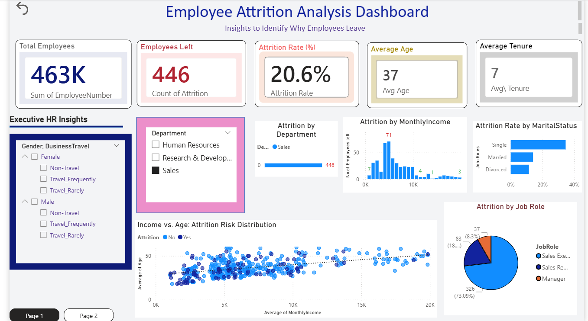
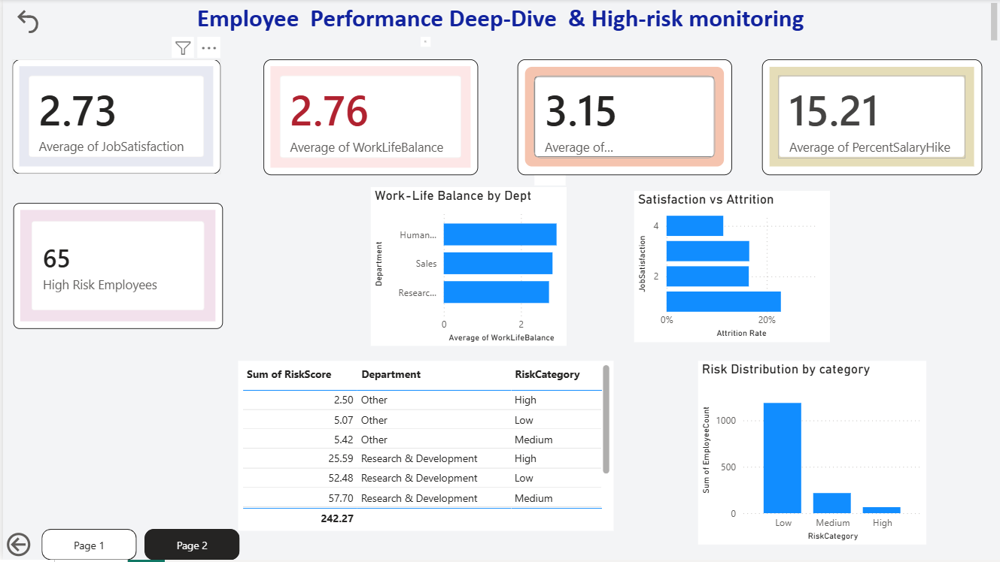

# Employee Attrition Prediction & Risk Analysis 📊🤖

## 📌 Project Overview
This project analyzes and predicts employee attrition for a workforce of 1,470 employees.

It combines:
- 📊 Power BI Dashboard (Business Intelligence)
- 🤖 Machine Learning Model (Predictive Analytics)

The goal is to help HR teams identify high-risk employees early and take preventive action.

---

## 🎯 Business Problem
Employee turnover increases hiring costs, reduces productivity, and impacts morale.  
This project identifies key drivers of attrition and builds a predictive model to estimate employee risk scores.

---

# 📊 Dashboard Overview (Power BI)

The dashboard provides both executive and operational insights:

### 🔹 Executive View
- Total Employees
- Employees Left
- Attrition Rate
- Average Age & Tenure
- Department-wise Attrition

### 🔹 Detailed Analysis
- Attrition by Job Role
- Attrition by Overtime
- Job Satisfaction & Work-Life Balance
- Performance vs Salary Hike
- Interactive Employee Directory with Heatmap formatting

---

## 🖼️ Dashboard Preview

### Page 1: Executive Overview

### Page 2: Employee Well-being & Details

---

# 🤖 Machine Learning Model

## Model Objective
Predict whether an employee is likely to leave and assign a **Risk Score (0–1 probability).**

## Models Used
- Logistic Regression
- Random Forest Classifier

## Evaluation Metrics
- Accuracy
- Precision
- Recall
- Confusion Matrix

Recall was prioritized to ensure high detection of at-risk employees.

---

## 📈 Key Predictive Drivers

Top factors influencing attrition:

- Overtime
- Low Job Satisfaction
- Low Work-Life Balance
- Lower Monthly Income
- Sales Representative Role

---

## 🔥 Risk Scoring System

Each employee is assigned a probability score:

- 0.82 → 82% risk of leaving
- 0.12 → 12% low risk

This allows HR to:
- Monitor high-risk employees
- Implement retention strategies
- Optimize promotion & compensation policies

---

# 📊 Key Business Insights

- Employees working overtime are 3x more likely to leave.
- Sales Representatives show the highest turnover rate (~40%).
- Younger employees with lower income show higher attrition probability.

---

# 🛠 Tools & Technologies Used

### Data Visualization
- Microsoft Power BI
- Power Query
- DAX (Attrition Rate, Avg Tenure)
- Data Modeling (Star Schema)

### Machine Learning
- Python
- Pandas
- Scikit-learn
- Jupyter Notebook

---
